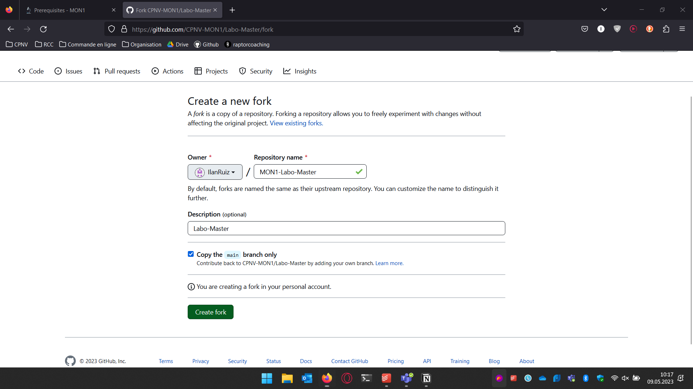
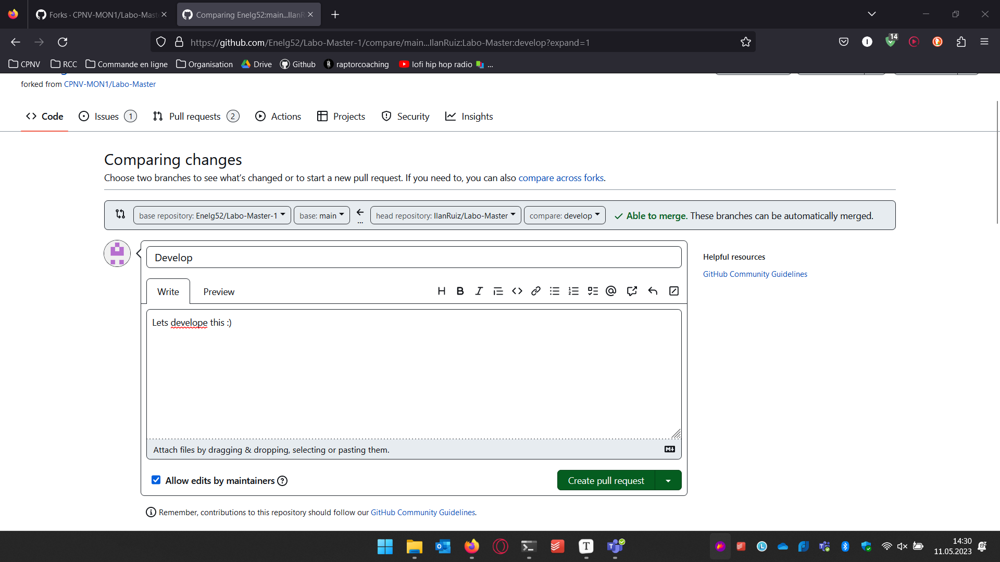
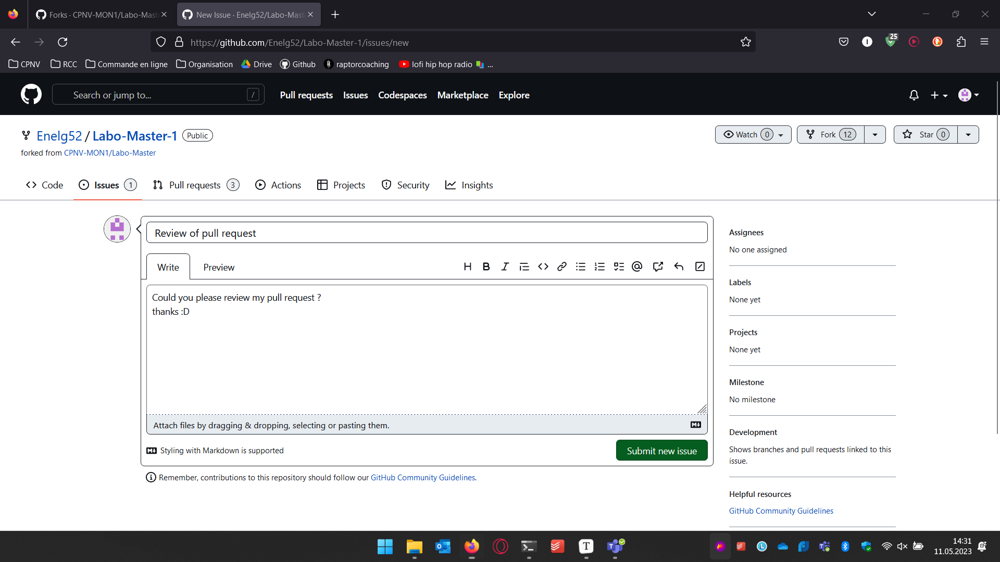
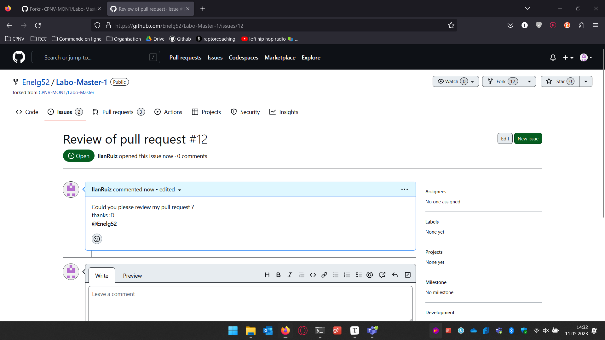

# Fork process

[Source](https://docs.github.com/en/get-started/quickstart/fork-a-repo)

<figure><figcaption><p>Git-flow scenario to master</p></figcaption></figure>

* [ ] Fork the "upstream" repository in your github organisation




* [ ] Clone your own repo in your local machine

```
PS C:\Reposite> git clone https://github.com/IlanRuiz/Labo-Master.git
Cloning into 'Labo-Master'...
remote: Enumerating objects: 24, done.
remote: Counting objects: 100% (8/8), done.
remote: Compressing objects: 100% (5/5), done.
remote: Total 24 (delta 3), reused 3 (delta 3), pack-reused 16
Receiving objects: 100% (24/24), 6.29 KiB | 805.00 KiB/s, done.
Resolving deltas: 100% (3/3), done.
PS C:\Reposite>
```

* [ ] Init Git flow (with standard settings)

```
PS C:\Reposite> cd .\Labo-Master\
PS C:\Reposite\Labo-Master> git flow init

Which branch should be used for bringing forth production releases?
   - main
Branch name for production releases: [main]
Branch name for "next release" development: [develop]

How to name your supporting branch prefixes?
Feature branches? [feature/]
Bugfix branches? [bugfix/]
Release branches? [release/]
Hotfix branches? [hotfix/]
Support branches? [support/]
Version tag prefix? []
Hooks and filters directory? [C:/Reposite/Labo-Master/.git/hooks]
PS C:\Reposite\Labo-Master> git push -u origin develop
Total 0 (delta 0), reused 0 (delta 0), pack-reused 0
remote:
remote: Create a pull request for 'develop' on GitHub by visiting:
remote:      https://github.com/IlanRuiz/Labo-Master/pull/new/develop
remote:
To https://github.com/IlanRuiz/Labo-Master.git
 * [new branch]      develop -> develop
branch 'develop' set up to track 'origin/develop'.
PS C:\Reposite\Labo-Master>
```

* [ ] Integrate updates from upstream (main) into your repository (develop)

```
PS C:\Reposite\Labo-Master> git push -u origin develop
Total 0 (delta 0), reused 0 (delta 0), pack-reused 0
remote:
remote: Create a pull request for 'develop' on GitHub by visiting:
remote:      https://github.com/IlanRuiz/Labo-Master/pull/new/develop
remote:
To https://github.com/IlanRuiz/Labo-Master.git
 * [new branch]      develop -> develop
branch 'develop' set up to track 'origin/develop'.
PS C:\Reposite\Labo-Master>
```

* [ ] Create a branch feature called "terraformBasicScript"

```
PS C:\Reposite\Labo-Master> git flow feature start terraformBasicScript
Switched to a new branch 'feature/terraformBasicScript'

Summary of actions:
- A new branch 'feature/terraformBasicScript' was created, based on 'develop'
- You are now on branch 'feature/terraformBasicScript'

Now, start committing on your feature. When done, use:

     git flow feature finish terraformBasicScript

PS C:\Reposite\Labo-Master>
```

* [ ] Add this code and commit it (feat:add basic terraform script")

```
terraform {
  required_providers {
    aws = {
      source  = "hashicorp/aws"
      version = "~> 4.16"
    }
  }

  required_version = ">= 1.2.0"
}

provider "aws" {
  region  = "us-west-2"
}

resource "aws_instance" "app_server" {
  ami           = "ami-830c94e3"
  instance_type = "t2.micro"

  tags = {
    Name = "ExampleAppServerInstance"
  }
}
```

```
PS C:\Reposite\Labo-Master> git add .
PS C:\Reposite\Labo-Master> git commit -m "feat:add basic terraform script"
[feature/terraformBasicScript af82fc9] feat:add basic terraform script
 1 file changed, 23 insertions(+)
 create mode 100644 labo-01-git-flow/terra.tf
PS C:\Reposite\Labo-Master> 
```

* [ ] Finish the feature

```
PS C:\Reposite\Labo-Master> git flow feature finish terraformBasicScript
Switched to branch 'develop'
Your branch is up to date with 'origin/develop'.
Updating 3192b2b..af82fc9
Fast-forward
 labo-01-git-flow/terra.tf | 23 +++++++++++++++++++++++
 1 file changed, 23 insertions(+)
 create mode 100644 labo-01-git-flow/terra.tf
Deleted branch feature/terraformBasicScript (was af82fc9).

Summary of actions:
- The feature branch 'feature/terraformBasicScript' was merged into 'develop'
- Feature branch 'feature/terraformBasicScript' has been locally deleted
- You are now on branch 'develop'

PS C:\Reposite\Labo-Master>

```

* Push this modification on your repository

```
PS C:\Reposite\Labo-Master> git status
On branch develop
Your branch is ahead of 'origin/develop' by 1 commit.
  (use "git push" to publish your local commits)

nothing to commit, working tree clean
PS C:\Reposite\Labo-Master> git push -u origin develop
Enumerating objects: 6, done.
Counting objects: 100% (6/6), done.
Delta compression using up to 8 threads
Compressing objects: 100% (4/4), done.
Writing objects: 100% (4/4), 582 bytes | 582.00 KiB/s, done.
Total 4 (delta 1), reused 0 (delta 0), pack-reused 0
remote: Resolving deltas: 100% (1/1), completed with 1 local object.
To https://github.com/IlanRuiz/Labo-Master.git
   3192b2b..af82fc9  develop -> develop
branch 'develop' set up to track 'origin/develop'.
PS C:\Reposite\Labo-Master>

```

* What happens to the feature/branch ?

```
It has merged with the «develop» branch.
```

* Open a pull request comparing your develop branch to your main
* Assign the pull request to your partner




* Notify him using a issue "Could you please review my pull request ?"

  

  

  

  ### source

For this exercice, i fallowed theses instructions:
https://www.red-gate.com/simple-talk/devops/tools/getting-started-with-gitflow/

