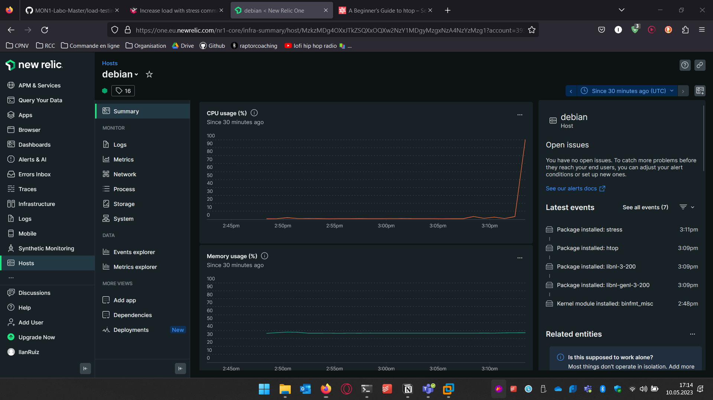

# Load testing

* [ ] Add htop to your Linux vm

* [ ] Add stress to your Linux vm and try to stress your cpu

* [Stress documentation](https://www.golinuxcloud.com/stress-command-in-linux/)

* [ ] In two ssh windows, stress your vm and observe the CPU load with htop

* [ ] Observer the CPU peak on NewRelic

